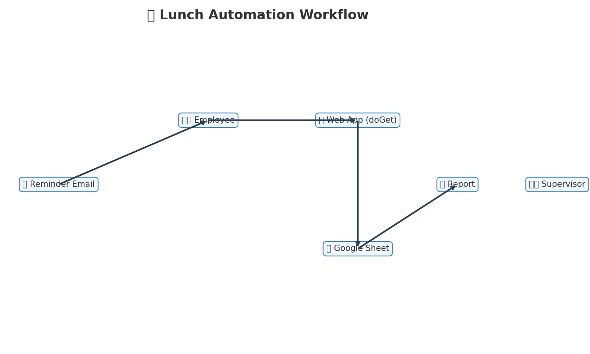

# 🍱 Pawa IT Lunch Automation Bot

This project automates the process of collecting daily lunch confirmations from employees using **Google Sheets** + **Google Apps Script**.  

Employees receive automated reminder emails with clickable buttons (`Yes`, `No`, `Yes for the whole week`). Responses are logged directly into a Google Sheet. Supervisors receive daily reports summarizing lunch orders and pending responses.

---

## ✨ Features

- **Custom Spreadsheet Menu**  
  - Added menu inside Google Sheets for HR/IT to manage the lunch bot.  
  - Options to send reminders, view pending responses, and manage triggers.  

- **Automated Email Reminders**  
  - Initial reminder at 8:30 AM.  
  - Final urgent reminder at 9:00 AM.  
  - Clickable buttons update the sheet instantly.  

- **One-Click Weekly Selection**  
  - Employees can confirm lunch for the entire week with a single click.  

- **Supervisor Reports**  
  - Daily summary email at 9:15 AM with counts, response rates, and pending employees.  

- **Smart Sheet Handling**  
  - Automatically creates new sheets for each weekday.  
  - Reuses template structure and copies employee info.  

- **Access Control**  
  - Restricts menu access to authorized users only.  

---

## 🛠️ Setup Instructions

1. **Create Google Spreadsheet**  
   - Add employee names & email addresses in the first two columns (`A: Name, B: Email`).  
   - The script will manage column `C` for lunch choices.

2. **Copy Script**  
   - Open **Extensions → Apps Script** in Google Sheets.  
   - Paste contents of `companysignup.js` into the editor.  

3. **Update Configuration**  
   At the top of the script, update:
   ```js
   const SPREADSHEET_ID = '<your-spreadsheet-id>';
   const SUPERVISOR_EMAIL = '<supervisor@company.com>';
   const WEB_APP_URL = '<your-deployed-web-app-url>';
   const AUTHORIZED_USERS = ['hr@company.com', 'it@company.com'];
   ```

4. **Deploy Web App**  
   - Go to **Deploy → New Deployment → Web App**.  
   - Execute as: *Me*.  
   - Access: *Anyone with the link*.  
   - Copy the deployment URL into `WEB_APP_URL`.  

5. **Set Up Triggers**  
   - In the spreadsheet, go to **🍱 Pawa IT Lunch Reminder → Setup Daily Triggers**.  
   - This creates automatic reminders & reports.  

---

## 📧 Email Templates

- **Reminder Emails**  
  - Stylish HTML + plain text fallback.  
  - Buttons: ✅ Yes | ❌ No | 📅 Whole Week.  

- **Final Reminder**  
  - Urgent styling + “Final Reminder” banner.  

- **Supervisor Report**  
  - Summary stats: total responses, pending employees, response rate.  
  - List of confirmed employees.  

---

## 📊 Example Workflow

1. **8:30 AM** → Bot sends first reminder.  
2. **9:00 AM** → Bot sends final urgent reminder.  
3. **9:15 AM** → Supervisor gets report.  
4. Employees can also be nudged manually via the custom menu.  

---

## 📊 Workflow Diagram



---

## 🔐 Access Control

Only users listed in `AUTHORIZED_USERS` can see the Lunch Bot menu in the spreadsheet. This prevents unauthorized changes.  

---

## 🚀 Ideas for Improvement

- ✅ Add Slack/Microsoft Teams integration for quick responses.  
- ✅ Add mobile push notifications (via Google Chat bots).  
- ✅ Log weekly trends (graphs of participation rates).  
- ✅ Auto-lock sheet rows after a cutoff time (e.g. 9:30 AM).  
- ✅ Multi-language support in emails.  

---

## 📄 License
MIT License – free to use and adapt.  
